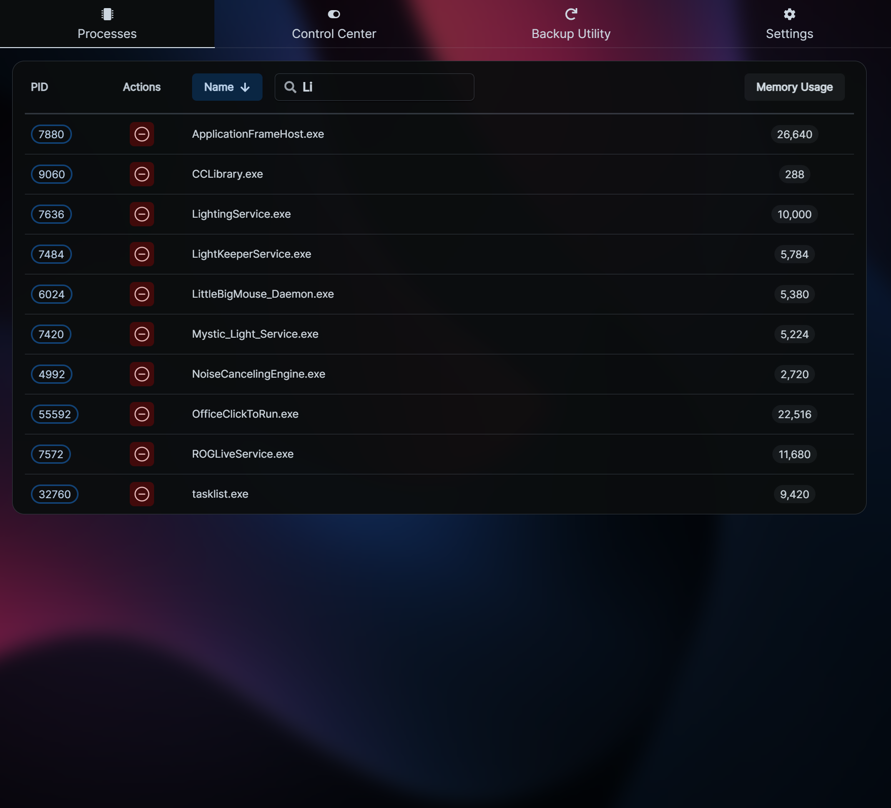
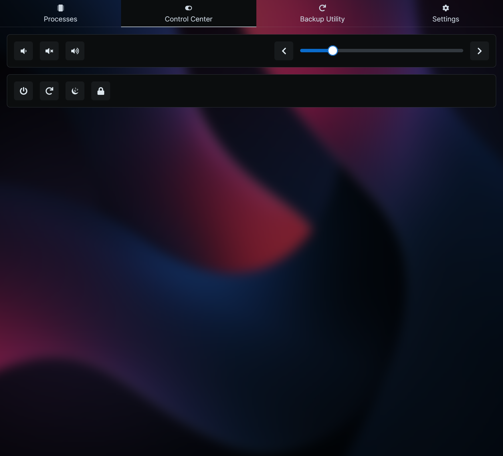
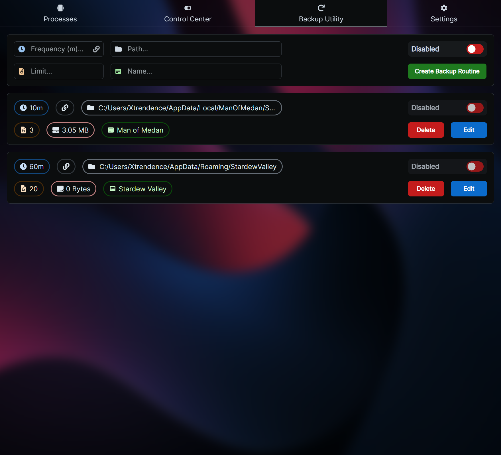
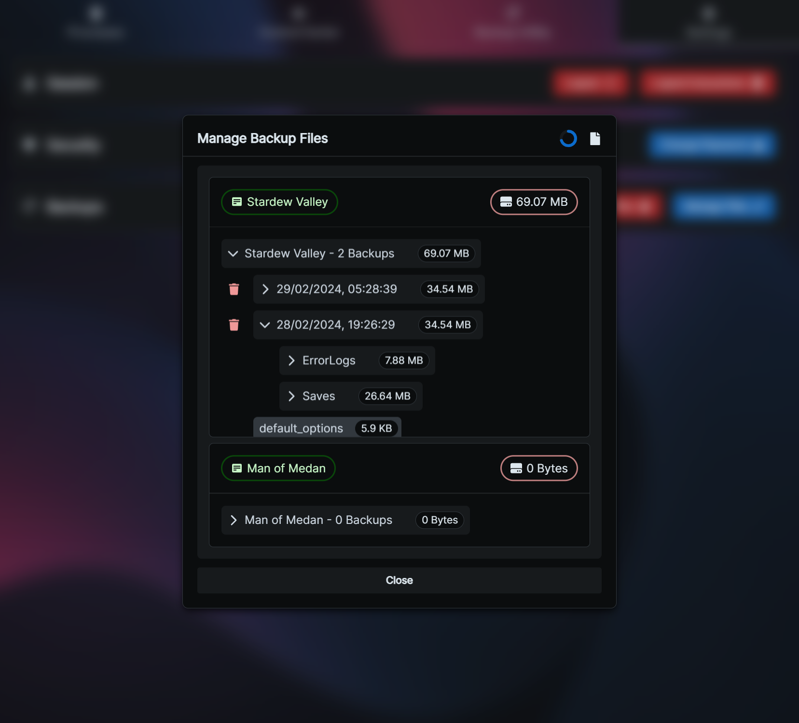

# XRC

A Node.js remote controller for machines running Windows with a variety of incredibly useful tools and features. Please use the table of contents below to find what you're looking for:

[1. Process Manager](#1-process-manager)

[2. Control Center](#2-control-center)

[3. Backup Utility](#3-backup-utility)

[4. Settings](#4-settings)

[5. Privacy](#5-privacy)

[6. Security](#6-security)

[7. Installation](#7-installation)

[8. Usage](#8-usage)

[9. Donations](#9-donations)

### 1. Process Manager



The process manager acts as a remote task manager for your PC. It serves 3 main purposes:

- You might have a game open or something you can't Alt + Tab away from, and a process running that's interfering with the current program. With XRC, you can just use your phone to find and kill the process without losing focus from the current window, and without any interruptions.

- A process might have frozen the entire system, and your mouse and keyboard may not even be working to get to task manager. XRC will still work, and you can use it to kill the non-responding process without being forced to restart and possibly lose progress in another application.

- You might just be lazy and have an application open with a bright UI that's flashbanging your eyes at 1 AM while you're in bed and the PC monitor is on. Do you physically get up and close the app? Do you go through the hassle of using TeamViewer and navigating that with your phone? Maybe you don't even trust remote control software that uses external servers. Just use XRC's interface, which is designed with mobile devices in mind and isn't awkward to navigate on a small screen, and doesn't have delays or bandwidth requirements.

### 2. Control Center



The control center allows you to adjust the volume of your PC. It also allows you to turn it off, lock it, put it in sleep mode or restart it. You might have music playing that you want to turn down but you aren't at your PC; now you can use your speakers to listen to music around the house without worrying about going back to adjust the volume when a song is too loud or too quiet.

You might be in bed at 1 AM, ready to sleep, but realize you left your PC on. Do you physically get up and turn it off? Now you can cut out the tiny amount of exercise you do by turning it off remotely with your phone! Maybe you are about to leave the house but realize you forgot to lock your PC, do you go all the way back to do so? Don't be silly, just use XRC.

### 3. Backup Utility



The backup utility is a lightweight way to backup specific files and folders at a chosen frequency. You can limit how many copies you want to save at any point in time (if the limit is reached, the oldest backup is deleted each time the backup interval is reached). There are checksum comparisons as well to ensure a redundant backup is never made. This utility is useful when you're doing something that doesn't require a full system backup, but might require incremental and small backups, such as playing a game where you want the world backed up frequently (such as Minecraft) or games where your decisions affect the ending, but some choices can be vague (such as The Dark Pictures Anthology). You can also specify for a backup routine to depend on a running process, this way the backup does not run if the game is not running. Clicking on the backup file size and the backup file path takes you to the backup folder and the original source folder respectively (to allow you to easily roll back to a previous backup).

### 4. Settings



Through the settings page, you can log out on the device you're currently on, log out all devices, change your password, or manage your backups. "Manage Files" allows you to browse the file structure of each individual backup, in addition to being able to delete specific backups.

### 5. Privacy

XRC is fully self-hosted and does not use any external APIs. Calls to other servers are not made at any point, and no data is ever sent outside your LAN. You can, of course, forward XRC's port and access it externally, but this is not recommended for security reasons (although great care has been taken to ensure a bad actor wouldn't actually be able to read the content of your backups, besides file names, or delete any files outside of your backups folder).

### 6. Security

Since XRC is self-hosted and meant to be used by devices on the same network, I assumed that most people would not want to deal with SSL certificates. As such, XRC has built-in client-side encryption for passwords during transit. Whether you're logging in or changing your password, nobody on the local network would be able to read your password. Other data is in plaintext though, and they could potentially capture your session token, so if there are other people on your network and you are concerned about them accessing XRC, ensure you only allow connections to XRC's port from whitelisted IPs or MAC addresses (though these can be spoofed, if someone in the network is going to these lengths, you might have bigger worries).

### 7. Installation

Use the Releases section to download the latest stable build for both the server and the client. Use [PM2](https://pm2.keymetrics.io/) or [NSSM](https://nssm.cc/) to run the server as a service (use `ts-node` if you don't want to transpile from TypeScript to JavaScript, `ts-node api/server.ts`). Use a package such as `serve` to serve the client build (`serve app/build`).

### 8. Usage

By default, port `3000` is used, but this can be changed (when using `yarn run dev` to serve the client) by setting a `PORT` variable in the client's `.env` file (simply remove `.example` from `.env.example` and fill out the file). If you're using `serve`, you can use `serve -l 3039` to specify the port. The default port for the API is `3040`, so ensure that is in the `.env` file as well like so:

```
REACT_APP_API_PORT=3040
PORT=3039
```

Access the application by going to the local IP of the server followed by the client's port like so:

`http://192.168.1.50:3039`

### 9. Donations

If you like my work and would like to support me, you can donate to the following addresses by scanning the QR codes below, or by copying the addresses. You can also use PayPal by following this link: https://www.paypal.com/paypalme/Xtrendence

<center>

#### PayPal

[](https://www.paypal.com/paypalme/Xtrendence)

#### Bitcoin


#### Ethereum


#### Cardano


#### Monero


</center>
